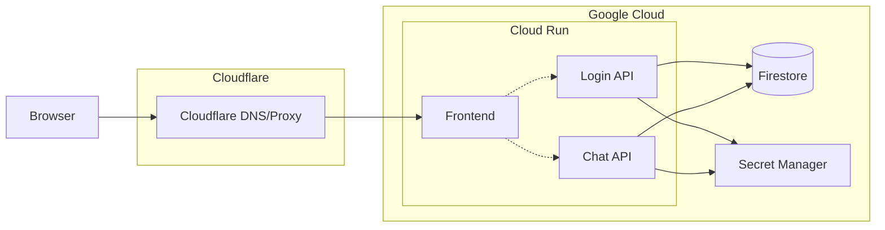

# LukeLaRue Infrastructure

This directory houses Terraform configuration for the LukeLaRue production environment powering `lukelarue.com`.

## Bootstrap & State Setup

### Prerequisites
- **Google Cloud project** Configure `gcloud` with owner-level credentials.
- **Terraform >= 1.5.0** Installed locally or in CI.
- **State bucket** A GCS bucket (example: `lukelarue-terraform-state`) for Terraform state with versioning enabled.

### Create State Bucket
Adjust names, region, and project as needed before running the commands. Execute with an owner account; Terraform will provision the CI/CD service account during apply.

#### Windows (PowerShell)
```powershell
$ProjectId = "parabolic-env-456611-q9"
$BucketName = "lukelarue-terraform-state"
$BucketLocation = "us-central1"

gcloud storage buckets create "gs://$BucketName" `
  --project "$ProjectId" `
  --location "$BucketLocation" `
  --uniform-bucket-level-access

gcloud storage buckets update "gs://$BucketName" --versioning
```

#### macOS / Linux (bash)
```bash
PROJECT_ID="parabolic-env-456611-q9"
BUCKET_NAME="lukelarue-terraform-state"
BUCKET_LOCATION="us-central1"

gcloud storage buckets create gs://${BUCKET_NAME} \
  --project "${PROJECT_ID}" \
  --location "${BUCKET_LOCATION}" \
  --uniform-bucket-level-access

gcloud storage buckets update gs://${BUCKET_NAME} --versioning
```

### Initialize Terraform
After creating the bucket and updating `backend.tf` with the correct bucket name and prefix, run the initial Terraform setup from the `infra/` directory:

```bash
terraform init
```

## Local Terraform Checks (CI Parity)

The `terraform-checks` GitHub Actions workflow runs formatting, linting, validation, and drift detection. Mirror those steps locally from the `infra/` directory:

```bash
terraform fmt -check -recursive
tflint --init          # installs configured plugins (first run only)
tflint --recursive
terraform validate -no-color
terraform plan -detailed-exitcode -no-color   # optional drift detection
```

> Ensure you are authenticated to Google Cloud (`gcloud auth application-default login` or Workload Identity Federation) so `terraform plan` can access remote state and project resources.

## Architecture Overview
- **Frontend** Runs on Cloud Run with domain mapping for `lukelarue.com`. Cloudflare proxies the public domain.
- **Login API** (`services/login-api`) runs on Cloud Run, handles Google sign-in, session cookies, and persists user profiles to Firestore. Accessed directly via Cloud Run URL.
- **Chat API** (`services/chat-api`) runs on Cloud Run, performs channel/message operations backed by Firestore. Accessed directly via Cloud Run URL.
- **Firestore** Native-mode database shared by both APIs for auth profiles and chat data. Provisioned via Terraform (`firestore.tf`) after enabling the Firestore API, with destroy protection enabled for safety.
- **Secret Manager** Stores sensitive configuration (session JWT secret, OAuth client ID, etc.) injected into Cloud Run revisions.
- **Artifact Registry & CI/CD** Host Docker images built from the repository; GitHub Actions (with Workload Identity) or Cloud Build deploy updated revisions.
- **Cloudflare DNS** Remains authoritative for `lukelarue.com`, with CNAME records pointing to Cloud Run domain mappings.



## Service Interactions
- **Frontend ↔ Login API** `apps/web` uses `VITE_LOGIN_API_BASE_URL` (set to the Cloud Run URL) to exchange Google credentials for session cookies via `POST /auth/google` and read sessions via `GET /auth/session`.
- **Frontend ↔ Chat API** `apps/web` calls chat endpoints with `x-user-id` headers sourced from the authenticated session and reads/writes messages via `VITE_CHAT_API_BASE_URL`.
- **APIs ↔ Firestore** Login API persists user profiles; Chat API stores channels and messages. Emulator flags are disabled in production via Terraform-managed environment variables.
- **CI/CD** Builds Docker images from `services/login-api`, `services/chat-api`, and `apps/web` using their Dockerfiles, pushes to Artifact Registry, and triggers `gcloud run deploy`. Frontend build receives API URLs via build args. Terraform automation in GitHub Actions authenticates via workload identity federation (no JSON keys) to run format, lint, validate, and plan checks.

## Terraform Layout
- **`backend.tf`** Configures remote state (GCS bucket + prefix) and providers.
- **`firestore.tf`** Enables required services and provisions the default Firestore database with destroy protection.
- **`cloud_run.tf`** Define Cloud Run services, domain mappings, and outputs for API URLs.
- **`artifact_registry.tf`** Creates Artifact Registry Docker repositories for the Login and Chat API images.
- **`variables.tf`** Capture customizable project IDs, regions, and domain names.

## Required GitHub Repository Variables

After running `terraform apply`, set these variables in GitHub repository settings:

| Variable | Description | Example |
|----------|-------------|----------|
| `VITE_LOGIN_API_BASE_URL` | Login API Cloud Run URL | `https://login-api-xxx-uc.a.run.app` |
| `VITE_CHAT_API_BASE_URL` | Chat API Cloud Run URL | `https://chat-api-xxx-uc.a.run.app` |

Get the URLs from Terraform output:
```bash
terraform output login_api_url
terraform output chat_api_url
```

## DNS Configuration (Cloudflare)

After `terraform apply`, configure Cloudflare DNS with the domain mapping records:

```bash
terraform output frontend_domain_mapping_records
```

Typically, you'll add CNAME records pointing to `ghs.googlehosted.com` for each domain.
