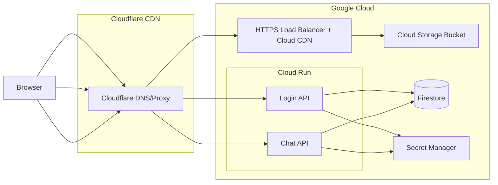

# LukeLaRue Infrastructure

This directory houses Terraform configuration for the LukeLaRue production environment powering `lukelarue.com`.

## Architecture Overview
- **Frontend** Static assets from the Vite build are uploaded to a Cloud Storage bucket and served via Cloud CDN behind a HTTPS load balancer. Cloudflare proxies the public domain and routes traffic to the Google endpoint.
- **Login API** (`services/login-api`) runs on Cloud Run, handles Google sign-in, session cookies, and persists user profiles to Firestore.
- **Chat API** (`services/chat-api`) runs on Cloud Run, performs channel/message operations backed by Firestore.
- **Firestore** Native-mode database shared by both APIs for auth profiles and chat data.
- **Secret Manager** Stores sensitive configuration (session JWT secret, OAuth client ID, etc.) injected into Cloud Run revisions.
- **Artifact Registry & CI/CD** Host Docker images built from the repository; GitHub Actions (with Workload Identity) or Cloud Build deploy updated revisions.
- **Cloudflare DNS** Remains authoritative for `lukelarue.com`, with records pointing to the Google HTTPS load balancer and Cloud Run custom domains.



## Service Interactions
- **Frontend ↔ Login API** `apps/web` uses `VITE_LOGIN_API_BASE_URL` to exchange Google credentials for session cookies via `POST /auth/google` and read sessions via `GET /auth/session`.
- **Frontend ↔ Chat API** `apps/web` calls chat endpoints with `x-user-id` headers sourced from the authenticated session and reads/writes messages.
- **APIs ↔ Firestore** Login API persists user profiles; Chat API stores channels and messages. Emulator flags are disabled in production via Terraform-managed environment variables.
- **CI/CD** Builds Docker images from `services/login-api` and `services/chat-api` using the repository Dockerfiles, pushes to Artifact Registry, and triggers `gcloud run deploy`. Frontend deploy stage uploads `apps/web/dist` to the storage bucket and invalidates Cloud CDN caches.

## Terraform Layout
- **`backend.tf`** Configures remote state (GCS bucket + prefix) and providers.
- **`main.tf` / modules** Define Firestore, Cloud Run services, Artifact Registry, Cloud CDN load balancer, service accounts, secrets, and DNS records.
- **`variables.tf` / `outputs.tf`** Capture customizable project IDs, regions, bucket names, and important endpoints.

## Bootstrap & State Setup

### Prerequisites
- **Google Cloud project** Configure `gcloud` with owner-level credentials.
- **Terraform >= 1.5.0** Installed locally or in CI.
- **State bucket** A GCS bucket (example: `lukelarue-terraform-state`) for Terraform state with versioning enabled.

### Create State Bucket
Adjust names, region, and project as needed before running the commands. Execute with an owner account; Terraform will provision the CI/CD service account during apply.

#### Windows (PowerShell)
```powershell
$ProjectId = "parabolic-env-456611-q9"
$BucketName = "lukelarue-terraform-state"
$BucketLocation = "us-central1"

gcloud storage buckets create "gs://$BucketName" `
  --project "$ProjectId" `
  --location "$BucketLocation" `
  --uniform-bucket-level-access

gcloud storage buckets update "gs://$BucketName" --versioning
```

#### macOS / Linux (bash)
```bash
PROJECT_ID="parabolic-env-456611-q9"
BUCKET_NAME="lukelarue-terraform-state"
BUCKET_LOCATION="us-central1"

gcloud storage buckets create gs://${BUCKET_NAME} \
  --project "${PROJECT_ID}" \
  --location "${BUCKET_LOCATION}" \
  --uniform-bucket-level-access

gcloud storage buckets update gs://${BUCKET_NAME} --versioning
```

### Initialize Terraform
After creating the bucket and updating `backend.tf` with the correct bucket name and prefix, run:

```bash
terraform init
```

Then follow with optional validation:

```bash
terraform fmt
terraform validate
```
